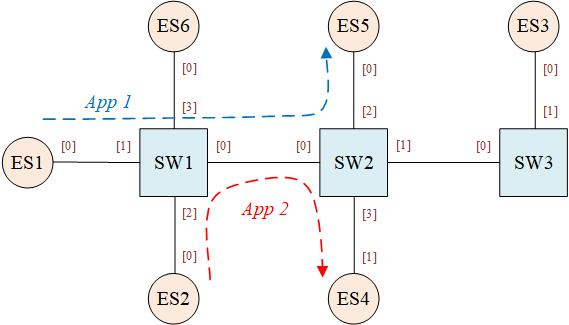

# Reliability Analysis under Traffic Scheduling

## Case

### Topology

### Application setting

App1
- path: ES1[0] ---- [1]SW1[0] ---- [0]SW2[2] ---- [0]ES5
- size: 100 bytes
- priority: 7
- interval: 1

App2
- path: ES2[0] ---- [2]SW1[0] ---- [0]SW2[3] ---- [1]ES4
- size: 300 bytes
- priority: 5
- interval: 2

